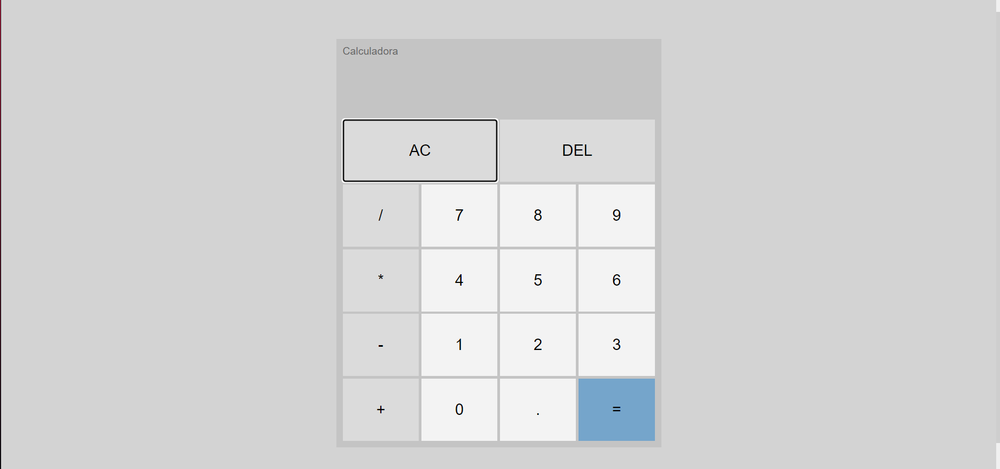

## 👨‍🏫Projeto




## 👨🏻‍💻Tecnologias usadas
Projeto foi desenvolvido utilizando as seguintes tecnologias:
  * HTML5
  * CSS3
  * JavaScript

## ▶️Como rodar
  
 ### **Passo a passo para rodar a aplicação**  
1. Faça o clone do repositório :

```sh
  $ git clone https://github.com/pedrinw/Calculadora.git
```


<h4 align="center">
    👨🏻‍🚀 Feito por Pedro Henrique
</h4>